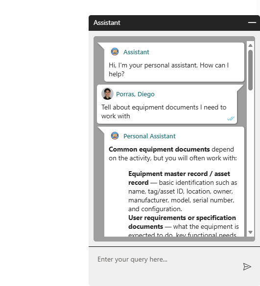

<!--
Credits and references used in this README:

1) Layout ideas and section inspiration:
   https://github.com/abhisheknaiidu/awesome-github-profile-readme?tab=readme-ov-file#descriptive-

2) Skill icons:
   https://github.com/tandpfun/skill-icons?tab=readme-ov-file#icons-list

3) GitHub stats card:
   https://github.com/anuraghazra/github-readme-stats
-->

# Diego Porras 🐺
**`Software Engineering Intern @ Medtronic | Stanford CS`**

## About Me
- I build software and AI systems that improve how people learn, work, and access important services.
- Currently developing enterprise software and AI tools as an Engineering Intern at Medtronic.
- Interested in software engineering, machine learning, generative AI, computer vision, and systems.

## Skill stack
<!-- Skill icons provided by skill-icons. Full icon list and names:
     https://github.com/tandpfun/skill-icons?tab=readme-ov-file#icons-list -->

**Also comfortable with**: SQL, ASP.NET MVC, Entity Framework, Laravel, Express, SPFx, PyTorch, Hugging Face, pandas, NumPy, statsmodels, REST APIs, SQL Server, SharePoint, and UNIX/Bash.

---

## Projects - showcase

<table>
  <tr>
    <td align="center" width="33%">
      
       
      <b>CURVLM</b> 
      Fine-tuned a vision-language model to analyze digital circuit diagrams and produce structured visual reasoning. 
      🔗 <a href="https://github.com/dpgonz/curvlm">Repo</a>
       
      Tags: Computer Vision, VLMs, PyTorch
    </td>
    <td align="center" width="33%">
      
       
      <b>SharePoint AI Assistant</b> 
      Built a full-stack conversational AI interface embedded in SharePoint and connected to an enterprise AI API. 
      🔗 <a href="https://github.com/dpgonz/sharepoint-ai-assistant">Repo</a>
       
      Tags: React, TypeScript, SPFx, Node.js
    </td>
    <td align="center" width="33%">
      
       
      <b>AINARA Quality Evaluator</b> 
      Built an LLM-powered agent that evaluates AI-generated educational content for quality, safety, and alignment. 
      🔗 <a href="https://github.com/dpgonz/ainara-quality-evaluator">Repo</a>
       
      Tags: Generative AI, Laravel, REST APIs
    </td>
  </tr>
</table>

<table>
  <tr>
    <td align="center" width="50%">
      
       
      <b>Mexican Food Review Analysis</b> 
      Analyzed 80 hand-coded restaurant reviews to compare perceptions of Mexican food in Madrid and Los Angeles. 
      🔗 <a href="https://github.com/dpgonz/mexican-food-authenticity-madrid-la">Repo</a>
       
      Tags: Data Analysis, Python, Statistics
    </td>
    <td align="center" width="50%">
      
       
      <b>Movie Ticket Agent</b> 
      Built an AI agent that recommends movies, remembers user preferences, searches showtimes, and manages ticket-booking actions. 
      🔗 <a href="https://github.com/dpgonz/movie-ticket-agent">Repo</a>
       
      Tags: AI Agents, Tool Use, Memory
    </td>
  </tr>
</table>

---

## Links
<!-- Section layout inspired by Awesome GitHub Profile README "Descriptive" patterns:
     https://github.com/abhisheknaiidu/awesome-github-profile-readme?tab=readme-ov-file#descriptive- -->
- [**Contact**](mailto:dpg0622@stanford.edu)

